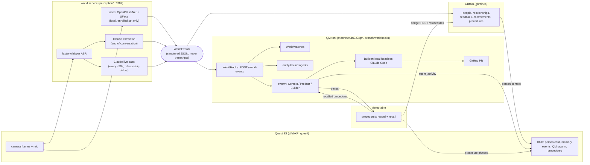

<!-- Product name: "Present" (undecided vs "WORLD"). To swap, search-replace the word Present in README.md, docs/DEVPOST.md, docs/PITCH.md. WorldEvents / WorldHooks / WorldWatches are layer names and stay. -->

# Present

**Your AI shouldn't stop knowing you when you close your laptop.**

Present is a reality layer for personal AI: it turns what you see and hear into structured WorldEvents that your memory (GBrain), your agents (QM) and their learned skills (Memorable) can act on.

## 20-second pitch

Every agent today only knows what you type into it. The most important context in your life, the customer who told you what's broken, the promise you made across the table, happens away from the keyboard. Present puts a camera and mic on your face, recognizes the (opted-in) people you talk to, pulls out feedback, commitments and requests, remembers them in GBrain, and fires a QM agent swarm that does the follow-up, up to a Claude Code PR, while you're still in the conversation. You never talk to the AI. You just live.

## Why a headset

The Meta Quest 3S is the dev kit, not the product. It has what open smart glasses will have: cameras, mics, head pose, hand tracking, passthrough and spatial rendering. We build against it today so the same pipeline runs on glasses tomorrow. The client is a WebXR page, so nothing about it is Quest-specific beyond the browser.

## Architecture



Event contract (binding for every component): [`contracts/EVENTS.md`](contracts/EVENTS.md).

## What's new for each sponsor

Only what is in the code today.

### QM: WorldHooks fork ([MatthewKim323/qm](https://github.com/MatthewKim323/qm/tree/worldhooks), branch `worldhooks`, 18 commits on upstream `main`)

- **WorldHooks**: a new first-class trigger, `POST /world-events`, next to cron / webhook / watch. Routes a WorldEvent by `type` to standing orders and an optional swarm plan (`deploy/worldhooks/world-hooks.json`): `customer_feedback.detected` -> Context / Product / Follow-up, `feature_request.detected` -> Context / Product / Builder. Bearer or HMAC auth, each event id fires once.
- **Memorable for event-triggered turns (fix)**: upstream QM's native Memorable integration skips capture on automated turns and never runs query-based recall on a turn, so a WorldHook swarm recorded nothing and recalled nothing. The fork captures every session of a finished world swarm, recalls procedures on every root and worker turn, and keys both on a stable task line (`Handle world event <type> about <product> <feature>: ...`) so a similar real-world event recalls with no typed prompt. Look-only shell commands are recorded as reads.
- **Swarm tracker**: follows root + workers in Postgres, streams `agent_activity` to the HUD, measures each run (turns, tool calls, failed calls, wall time), keeps reports at `GET /world-runs`, and posts an honest run 1 vs run 2 line (it says `NO GAIN` when there isn't one).
- **WorldWatches**: standing watches over world events. Saying "next time Matthew brings up pricing, prep a counter-offer" becomes a watch with one model call (verified live).
- **Entity-bound agents**: pinch a person or object in the headset and it gets one persistent QM thread (`world:entity:<kind>:<id>`) that every later event about it lands in.
- **Builder**: runs in the world service (`BUILDER_AUTO=1` dispatches on the event; QM's Builder worker dispatches to the same `POST /builder/dispatch`, deduped per event), which runs headless Claude Code on the target repo and opens a `[WORLD]` PR. Real PRs: [qtzx06/opal #5 and #6](https://github.com/qtzx06/opal/pulls) are open; #7 to #12 were closed after measurement runs.

### Memorable

- Procedures recorded and recalled off real-world events through the QM fork above (not typed prompts).
- **Memorable -> GBrain bridge**: learned and recalled procedures flow to the world service (`POST /procedures`) and become GBrain pages (`procedures/<slug>`), linked to the person, project, event and signal they came from; the relationship timeline notes "agents learned / reused a procedure". Declarative and procedural memory stay separate but connected.
- The Builder's own Claude Code trace goes to `/v1/extract`; admitted drafts are recalled lexically into the next similar job.
- HUD shows every phase: recording, extracting, learned, recalled, refused (with Memorable's judge reason verbatim).

### GBrain (hosted gbrain.io)

- **Live relationship pages**: during a conversation a fast Claude pass (~2.2s, haiku) emits `relationship.updated` every ~20s, written straight to `relationships/<wearer>-<person>`, so the person card compounds mid-conversation.
- Every signal becomes its own page (`feedback/`, `commitments/`, `decisions/`, `feature-requests/`, `bugs/`) linked to person, project and situation; encounters and summaries become timeline entries. Transcripts never go in.
- A fresh process rebuilds the person card (you owe, owes you, last seen, relationship, recent deltas) from GBrain alone.
- Read-only GBrain proxy for QM workers (`/gbrain/query|page|person`), and every GBrain op shows on the HUD as a `gbrain_op` line.

## Privacy

Part of the product, not an afterthought.

- **Opt-in recognition only.** Faces are matched locally (OpenCV YuNet + SFace) against an enrolled set. No internet lookup, ever. Strangers stay `UNKNOWN PERSON 03`.
- **Self-introduction is the opt-in.** "I'm Matthew" said by the other person (or the wearer greeting them by name) enrolls them; the wearer saying a name doesn't, and a stranger saying an enrolled name never merges into that person.
- **Embeddings only.** `data/people.json` holds face embeddings, no photos. The filmstrip crops the HUD shows while learning are in-memory and never written.
- **No footage.** Frames and audio are processed in memory and dropped. Transcripts live only in the open conversation buffer. GBrain gets summaries and signals.
- **Forget someone:** `uv run python -m perception.enroll --remove <id>`.
- Memory is human-readable GBrain pages the user owns. Agents draft external messages and wait for approval.

## Run it

```bash
scripts/dev-up.sh              # QM fork (:8091) + world service (:8787) + Quest client (:5173)
scripts/dev-up.sh --tunnel     # plus an ngrok URL for a headset off this wifi
scripts/dev-up.sh status       # health of each piece
scripts/dev-up.sh down
scripts/cast-quest.sh --record # mirror + record the headset view over USB (scrcpy)
```

- No headset, no server: open `https://localhost:5173/?mock=1` (scripted HUD demo; `&mockseq=swarm` for the swarm take).
- No cameras: `cd perception && uv run python -m perception.demo_inject [--feature | --customer2 | --via-llm]`.
- Setup details: [`perception/README.md`](perception/README.md) (keys, GBrain auth, enrollment), [`quest/README.md`](quest/README.md) (dev mode, `adb reverse`, `?video=0` fallback), [`docs/QM.md`](docs/QM.md) (fork runbook, Memorable consent).

## Repo map

| Path | What |
|---|---|
| `contracts/EVENTS.md` | WorldEvent + HUD message contract |
| `perception/` | world service (Python, FastAPI): faces, ASR, extraction, live pass, GBrain sink, QM sink, Builder, HUD fanout |
| `quest/` | WebXR client (three.js + Vite): capture, HUD, dev cockpit, swarm graph, perception overlay |
| `seed/` | demo GBrain pages (people, relationships, project, event) |
| `scripts/` | `dev-up.sh`, `take.sh` (pre-take checklist), `cast-quest.sh`, `teammate-setup.sh` (second laptop, no QM) |
| `docs/` | [QM.md](docs/QM.md) (fork + measured runs), [SPONSORS.md](docs/SPONSORS.md), [HANDOFF.md](docs/HANDOFF.md), [DEVPOST.md](docs/DEVPOST.md), [PITCH.md](docs/PITCH.md) |
| `~/dev/qm` (separate repo) | QM fork, branch `worldhooks` |

## Status / what's measured

Works end to end: face match (~20ms/frame), whisper ASR, Claude extraction, live relationship deltas into gbrain.io, WorldEvent -> QM swarm on local Docker sandboxes, Memorable record + recall off real events, Builder PRs on Opal.

**Memorable run 1 vs run 2 has not shown a gain yet.** Real numbers from [`docs/QM.md`](docs/QM.md) (pi + claude-sonnet-5, totals across root + workers):

| Pair | Tool calls | Turns | Failed calls | Wall |
|---|---|---|---|---|
| Customer feedback C -> D (recall, default inject) | 36 -> 47 | 10 -> 10 | 4 -> 4 | 235s -> 361s |
| Customer feedback E -> F (recall, `l2` inject) | 41 -> 50 | 9 -> 7 | 2 -> 1 | 285s -> 248s |
| Opal feature request R1b -> R2 (`!recap` -> `!streak`) | 40 -> 42 | 10 -> 13 | 4 -> 4 | 245s -> 272s |

Baseline noise is bigger than the effect: four no-recall customer-feedback runs span 30-45 tool calls. Most cost is swarm plumbing (spawn, poll, workers discovering the swarm API), which is what a recalled procedure should cut next. The HUD reports `RUN 2 VS RUN 1 (NO GAIN)` rather than claim a win.

Other gaps: a swarm run takes 3-6 min (166-361s measured); on-device Quest camera via `getUserMedia` is the main hardware risk (fallback: laptop is the eye, headset runs `?video=0`); GBrain is not a native QM connector (workers read it through the world service proxy).
